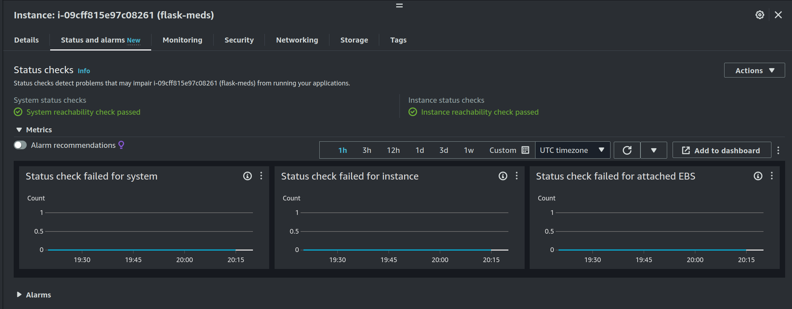
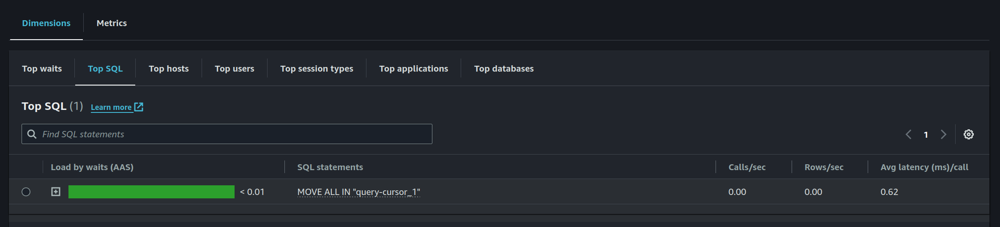
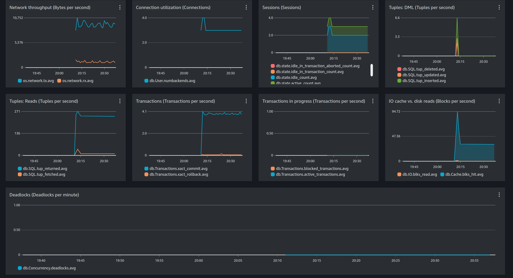

# DevOps Coding Challenge

## Development (local)

### Prerequisites

- Docker
- Docker Compose

### Installation and Running

1. Clone the repository
2. Run `docker compose watch` (hot reloading!)
3. Access the application at `http://localhost:5000`

## Production

### Deployment

This project is using ephemeral environments, so you need to create a branch starting with feat* then push a commit to it.

> This will trigger a workflow configured in `.github/workflows/cicd.yaml`, which uses the deploy script to provision all the resources in AWS using Terraform.
> You can see the application by accessing the EC2 DNS (Terraform output) provided in the workflow logs.

### Decommission

Just merge the feature branch to main or delete it.

> This will trigger a workflow configured in `.github/workflows/feat-delete.yaml`, destroying all the resources in AWS using Terraform, using the destroy.sh script.

## Scripts

The setup.sh creates the base infra S3, ECR and KMS to store Terraform state and images. It's ran only a single time and the state of these resources are versioned.

The deploy.sh creates all the necessary infra for the application and database.

The destroy.sh destroys the application and database infra.

## Monitoring

### Application

- Status checks for the EC2 instance (alarms available)

### Database

- Performance insights enabled

## Challenge Steps

[Steps](Steps.md)
