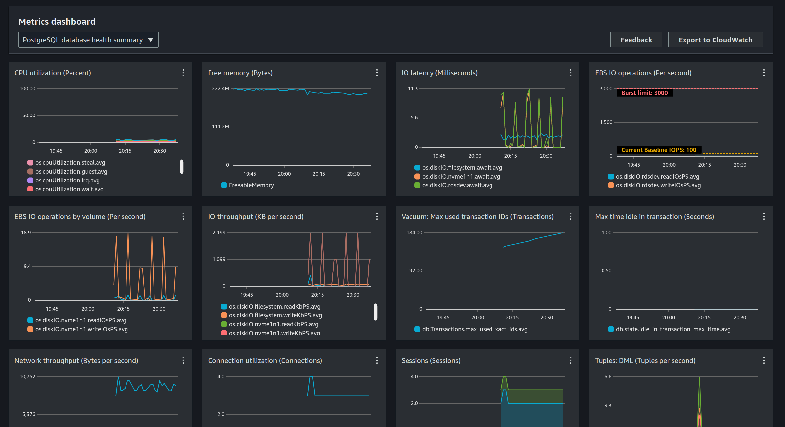

# DevOps Coding Challenge

## Development (local)

### Prerequisites

- Docker

### Installation and Running

1. Clone the repository
2. Run `docker compose watch` (hot reloading!)
3. Access the application at `http://localhost:5000` and Kibana at `http://localhost:5601`

> Kibana credentials are `elastic:changeme` (of course this is not recommended for production)
> Don't forget to stop the containers after you're done with `docker compose down`

## Production

### Deployment

This project is using ephemeral environments, so you need to create a branch starting with feat* then push a commit to it.

> This will trigger a workflow configured in `.github/workflows/cicd.yaml`, which uses the deploy script to provision all the resources in AWS using Terraform.
> After some minutes you can see the application by accessing the EC2 DNS (Terraform output) provided in the workflow logs. For example: `http://ec2-3-238-142-191.compute-1.amazonaws.com:5000` for the application and `http://ec2-3-238-142-191.compute-1.amazonaws.com:5601` for Kibana.

### Decommission

Just merge the feature branch to main or delete it.

> This will trigger a workflow configured in `.github/workflows/feat-delete.yaml`, destroying all the resources in AWS using Terraform, using the destroy.sh script.

## Scripts

The setup.sh creates the base infra S3, and KMS to store Terraform state. It should be ran only a single time and the state of these resources are versioned.

The deploy.sh creates all the necessary infra for the application and database.

The destroy.sh destroys the application and database infra.

## Monitoring

This project is using CloudWatch and ELK stack for monitoring.

### CloudWatch

#### Application

- Status checks for the EC2 instance (alarms available)

#### Database

- Performance insights enabled

### ELK

The configuration and docker files are from this [repository](https://github.com/deviantony/docker-elk), but simplified and customized to this project.

#### Application

- A Heartbeat monitor is checking the health of the application every 5 seconds

- APM agent is installed in the application to monitor the performance

## Challenge Steps

[Steps](Steps.md)
